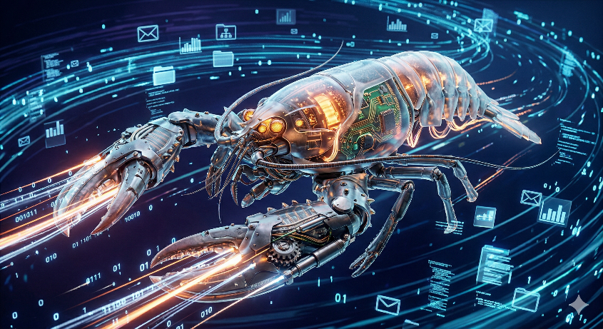

---
hide:
  - toc
---
# 你的專屬 AI 助理

{ width="600" }

在這個 AI 爆發的時代，你是否也想擁有一個「隨時待命」的智慧助手？  
AI Station 就是一個整合多種 AI 能力的平台，讓你可以在一個地方完成：  

- AI 對話  
- AI 寫作  
- AI 圖片生成  
- AI 翻譯  
- AI 自動化工作流程  

---

# 不是工程師、不用寫程式也能讓 AI 幫你做事

我們把原本複雜的 AI 系統，變成用手機就能操作的工具。  
不用學 Linux、不用打指令、也不用研究如何設定。  
只要打開手機，跟著畫面操作，你的專屬 AI 就開始幫你工作了！

- ✔ **不用敲指令**
- ✔ **不需技術背景**
- ✔ **開箱即插即用**

---

## 你是不是也有這種感覺？

AI 很強大，大家都在用，但當你真的想開始時，卻卡在第一步：

- 安裝過程太複雜
- 一堆看不懂的終端機指令
- 設定流程像是專為工程師設計的
- 擔心個人或公司資料不安全
- 想嘗試，又怕產生高昂的大型語言模型（LLM）費用

你不是不想用 AI，只是現在的工具對你來說太困難了。👉 **最後，只能選擇放棄。**

---

## 不用擔心，這一切超級 Easy

我們把原本屬於工程師的 AI 系統，重新設計成一個**「人人都能用」**的產品。  
你不需要理解背後的技術，也不需要學會任何指令。

👉 **只需要一支手機，就可以完成所有設定！**

### 📱 手機就能操作
不用電腦、不用打開終端機。打開手機，就能輕鬆完成設定與日常操作。

### ⚡ 開箱即用
插上電源、連上網路，只需幾分鐘的時間，就能開始使用你的專屬 AI。

### 🧠 會慢慢成長的 AI
這與一般的 ChatGPT 最大的不同！它不只能聊天，還能**串接工具、自動化流程**，  
變成真正幫你做事的 AI 助理。

---

## 🚀 什麼是 AI助理？

AI助理 是一個「AI 中控台」概念的平台，透過 API 串接各種大型語言模型（LLM），讓使用者可以：

- 不需要切換平台
- 不需要理解複雜 API
- 不需要寫程式

就能直接使用 AI 能力。

這種模式類似「AI 聚合平台」，將不同 AI 工具整合成一個工作站。

---

## 🧠 AI 小幫手可以做什麼？

### ✍️ 內容創作
- 撰寫文章
- 產生 SEO 文案
- 自動生成 WordPress 貼文

### 💻 工程應用
- 產生 Shell Script
- Debug 程式碼
- 協助架設服務（Docker / Nginx / Linux）

### 🌐 網頁與資料處理
- 網頁摘要
- API 資料整理
- JSON / Markdown 轉換

### 🎨 多媒體生成
- AI 繪圖
- 圖片生成 Prompt
- 設計素材輔助

### 🎨 自動化排程與資料收集
- 每天自動分析個股投資資訊
- 整理學校/工作課表
- 個人行事曆管理

---

## 🔧 為什麼要用 AI Station？

傳統使用 AI 工具會遇到：

- 多平台切換（ChatGPT / Gemini / Claude）
- API Key 管理混亂
- 成本不可控

AI Station 解決這些問題：

- ✅ 單一入口
- ✅ 統一操作介面
- ✅ 模型自由切換
- ✅ 可整合自動化流程

---

## ⚙️ 適合哪些人？

- 工程師（DevOps / Web）
- 內容創作者
- WordPress 經營者
- 自動化工作流程需求者

---

## 🧩 AI Station 的核心價值

AI 不只是工具，而是「能力放大器」。

AI 助理 的目標不是取代人，而是讓你：

> 用更少時間，完成更多事情。

---

## 我們的核心理念

> **AI，不應該只屬於工程師。**
> 每一個人，都應該能擁有自己的 AI，而不是被困在複雜的設定裡。

**AI助理機想做的事情很簡單：**  
👉 讓 AI 像家電一樣，打開就能用。
👉 讓每個人都能輕鬆擁有。

**準備好擁有你的 AI 了嗎？**  
現在開始，你不需要再羨慕別人使用 AI。你可以擁有一台，真正屬於自己的 AI 主機！

---

## 常見問題 (FAQ)

**Q：我完全不懂技術，也可以用嗎？**  
**A：** 絕對可以，這正是「AI助理機」設計的初衷！

**Q：需要一直連網嗎？**  
**A：** 基本功能皆可在本地端（設備內）運行，並可依你的需求選擇是否連接外部網路服務。

**Q：資料會不會外流？**  
**A：** 不會。你的所有資料都保存在你專屬的實體設備中，擁有極高的隱私安全性。

---

## 📌 總結

AI 助理 = AI 工具整合平台 + 自動化工作站

如果你已經在使用 AI，那下一步就是：

👉 把 AI「系統化」

而不是只停留在「聊天工具」。

