# 🤖 AI助理 系統初始化指南

專屬設定精靈，只需幾個簡單步驟，立即喚醒您的 AI 助理。

---
## 初使化連接
待系統紅燈恆亮之後，看到綠燈閃爍時即表示進入初使化安裝，  
此時打開你的手機或電腦的WIFI設定處搜尋「openclawNPM6」開頭的網路並加入。
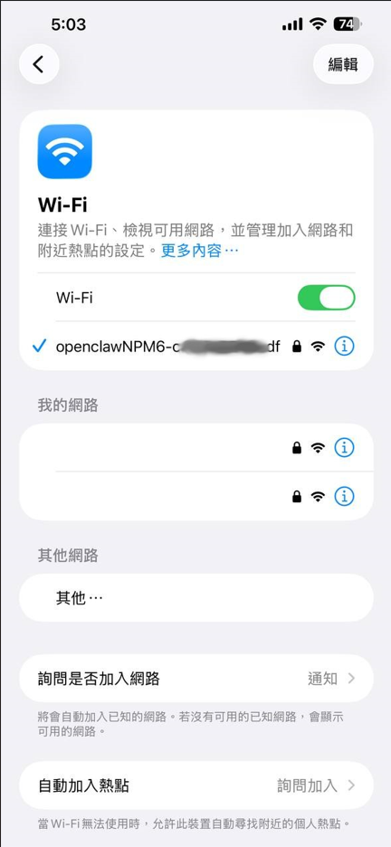  

**無線網路的預設密碼為 : 12345678**  
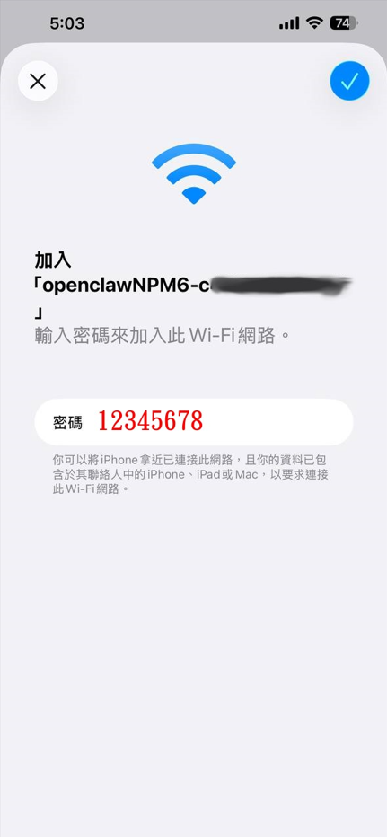    

接下來打開你的瀏覽器，輸入以下網址並連接： **10.42.0.1**
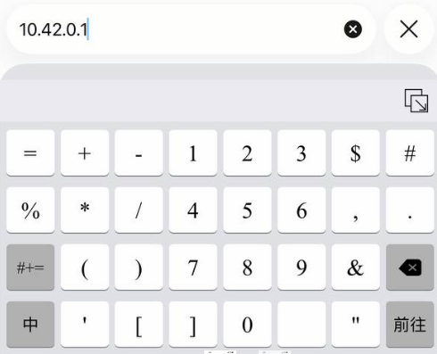 

## 1. 網路設定

首先，請為您的龍蝦機連接網路。您可以根據您的環境選擇以下三種方式之一：

* **有線網路 (DHCP 自動取得)：** 插入網路線後，系統將自動取得 IP 位址。
  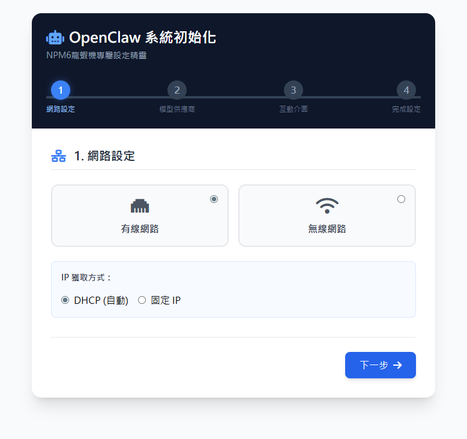
* **有線網路 (固定 IP)：** 適合需要固定內部 IP 的進階使用者。
  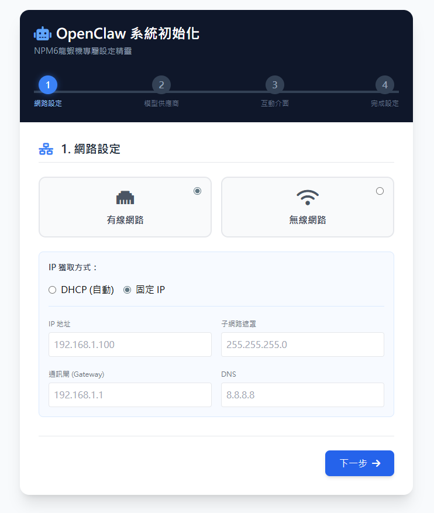
* **無線網路 (Wi-Fi)：** 選擇您家中的 Wi-Fi 基地台 (AP) 並輸入密碼即可連線。
  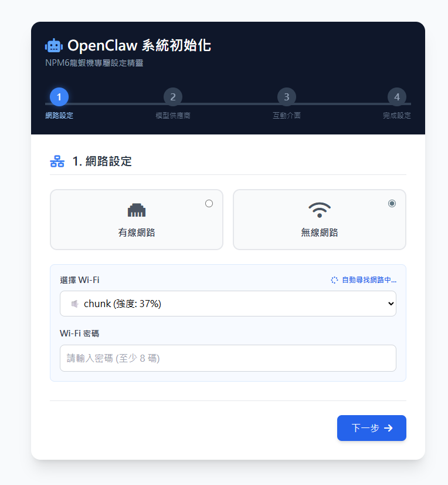

## 2. 選擇大語言模型供應商

### 選項 A：系統預設供應商 (Ollama) <small>*(推薦使用)*</small>

1. **已有 Ollama 帳戶：** 請直接填入您註冊的 Email 即可。
   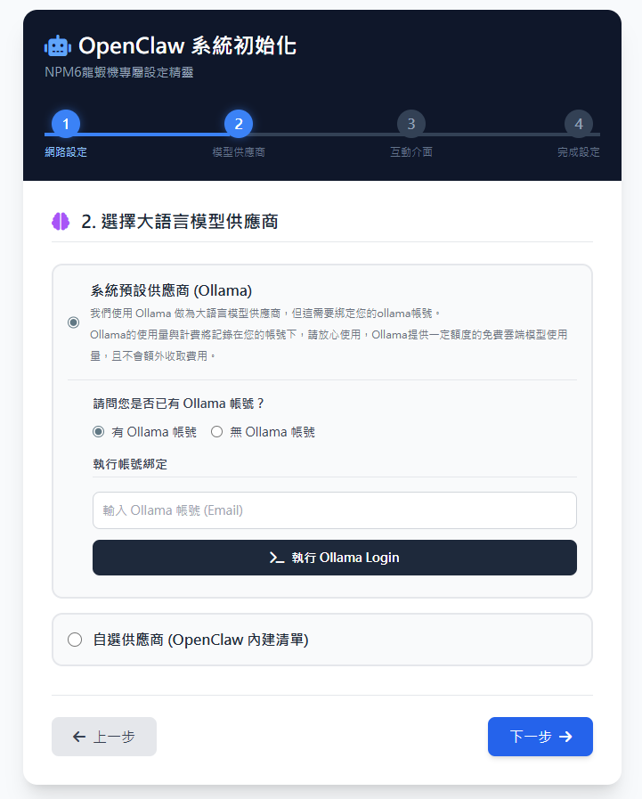
2. **尚未擁有帳戶：** 請點擊連結前往 Ollama 註冊頁面，建立帳號後再回來填入 Email。
   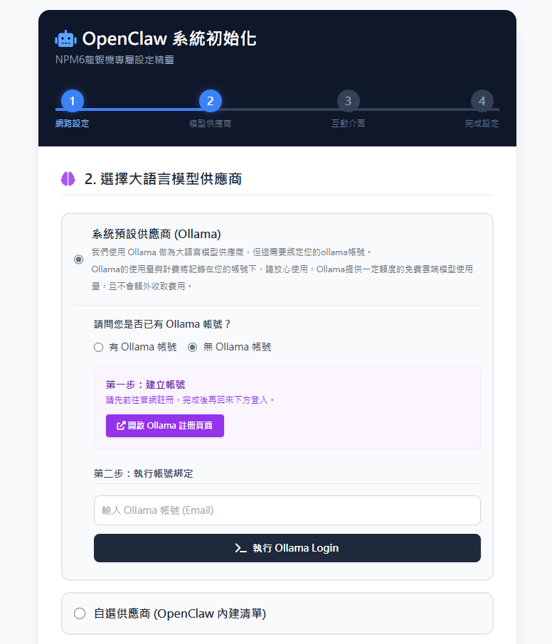
3. **綁定設備：** 填入 Email 後，點擊「執行 Ollama Login」。綁定成功後，**務必點擊綠色按鈕打開 Ollama 確認網頁**，以完成裝置連線授權。
   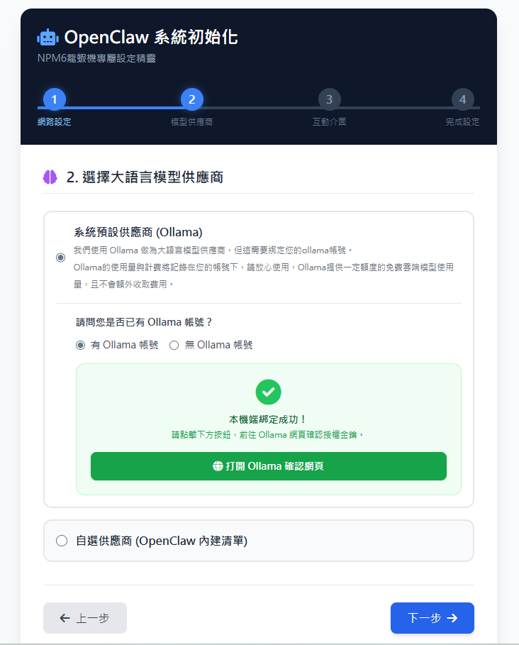
   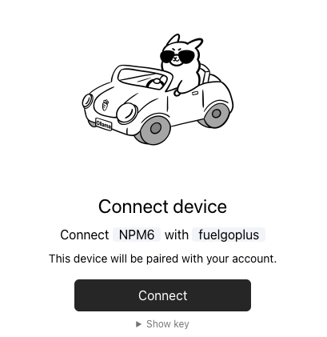

### 選項 B：自選供應商 (OpenClaw 內建清單)

如果您希望串接自己付費的商用大語言模型 (例如 OpenAI 等)，可在此選擇對應的供應商，並輸入您的 API Key 進行串接。
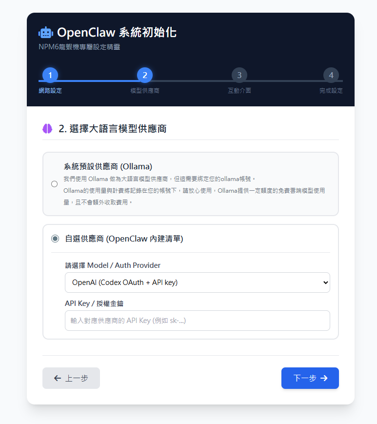

## 3. 選擇互動介面

設定您平時要用什麼軟體來呼叫您的龍蝦助理：

### 1. Telegram Bot (預設推薦)

請在 Telegram APP 內搜尋 `BotFather` 來創建一個專屬的機器人，取得 Token 後，將其複製並貼回設定頁面即可。
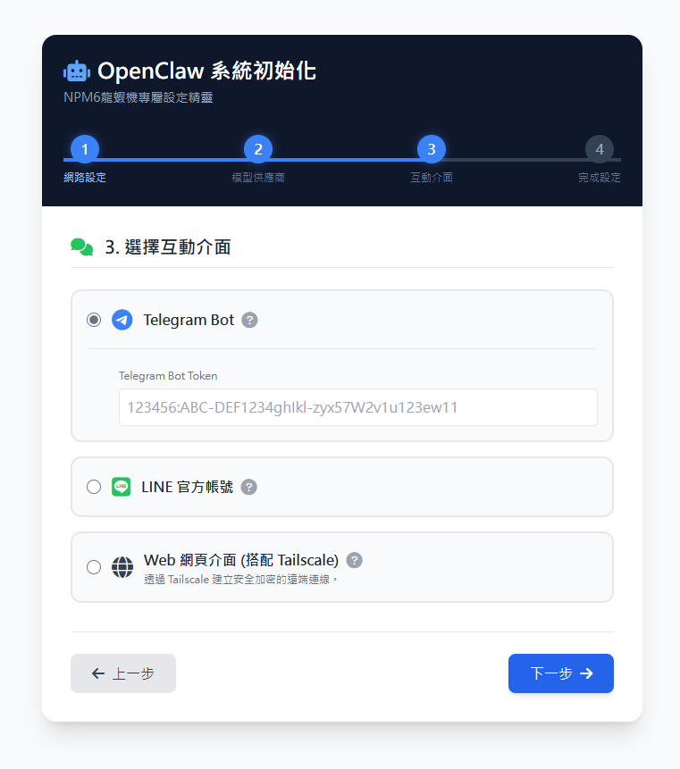

### 2. LINE 官方帳號

1. 請前往 LINE Developers 後台創建一個 LINE Bot。
2. 在「Basic settings」頁籤找到 **Channel secret**，複製並貼回。
3. 在「Messaging API」頁籤找到 **Channel access token**，複製並貼回。
4. **Webhook 設定：** 同樣在「Messaging API」頁籤中，將 `Use webhook` 打開。設定完成後系統會配發一組專屬網址給您，請將該網址貼入 LINE 後台的 Webhook URL 欄位並點擊 Update。最後點擊 Verify 按鈕，看到成功訊息即代表設定完成。
   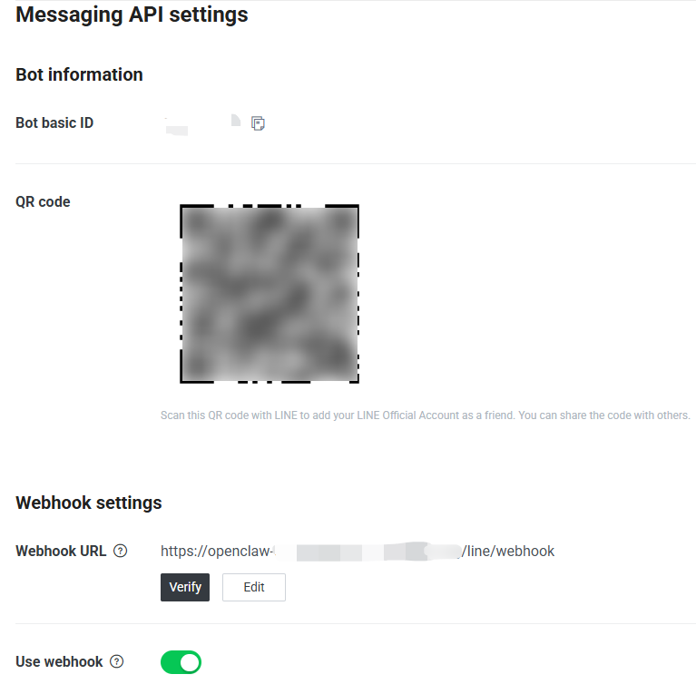

!!! warning "⚠️ 注意事項"
    本產品產生之 LINE Webhook 網址，僅供本裝置的 LINE Bot 運作使用，不得挪作他用。

### 3. Web 網頁介面 (搭配 Tailscale)

這是 OpenClaw 官方推薦的安全網頁使用方式。點擊「啟動 Tailscale」獲取授權連結。若無帳號系統會引導註冊。

!!! info "💡 安全提示"
    您的電腦、手機或平板也需要安裝 Tailscale APP。它會透過虛擬私人網路 (VPN) 技術，讓您的裝置與龍蝦機處於同一個安全的虛擬內網中，避免設備暴露於公開網路的風險。
     
    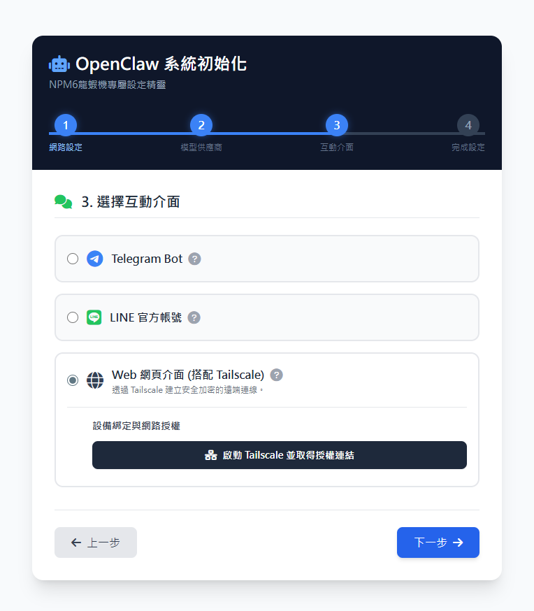

## 4. 注入靈魂：取個專屬名字

請為您的 AI 龍蝦助理取一個個性化的稱呼！他會記住這個名字，未來在任何對話介面中，您都可以用這個名字來呼喚他。
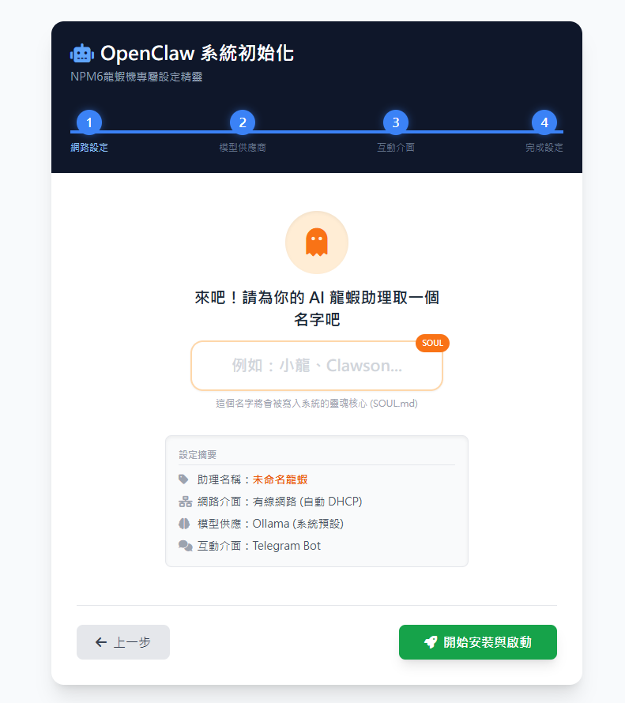

## 5. 系統喚醒與安全配對

### 1. 系統載入與喚醒

完成上述設定後，系統會倒數 10 秒進行設定載入與喚醒作業。
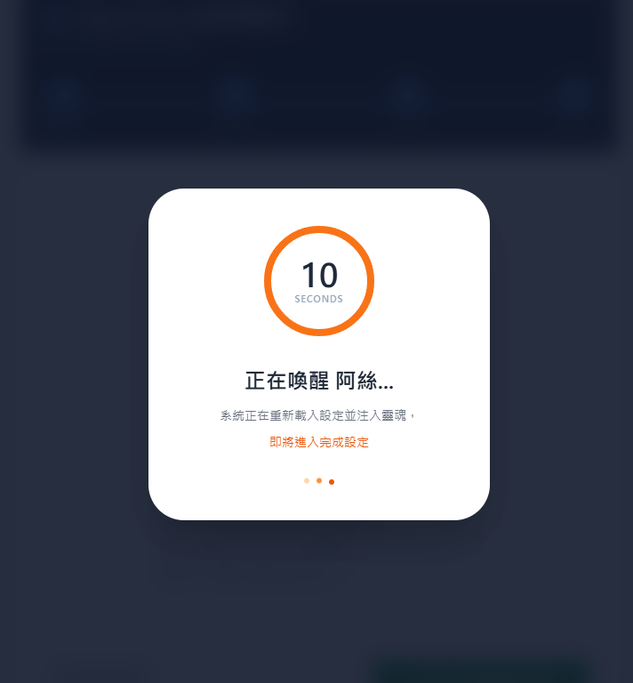
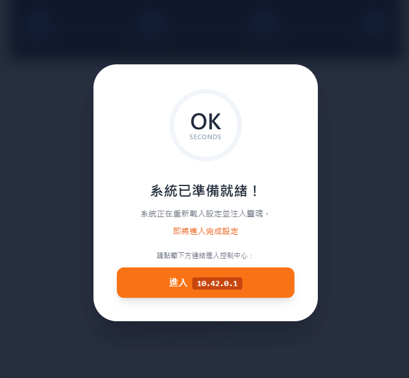

完成後點擊「進入」按鈕前往 OpenClaw Hub 控制中心。**(請記下畫面上的 IP 資訊，您日後也可以透過瀏覽器輸入此 IP 進入控制中心)**

### 2. 通訊軟體安全配對 **(非常重要)**

進入控制中心後，為了防止陌生人盜用您的機器人額度，我們設計了安全配對機制：
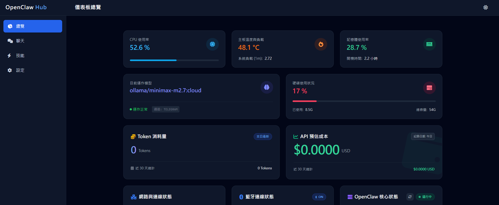

1. 請保持控制中心網頁開啟。
2. 前往您剛才設定的通訊軟體 (例如 Telegram)，對著您的機器人發送一則 `hi`。
3. 您的通訊軟體會收到一則帶有「配對碼 (Pairing code)」的系統訊息。
   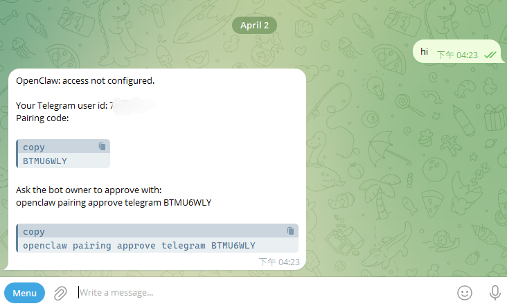
4. 回到控制中心網頁，上方會彈出一個「新裝置請求連線」的核准提示。
5. **核對配對碼：** 確認網頁上的配對碼與通訊軟體收到的一致，點擊「允許核准」即可完成綁定！
   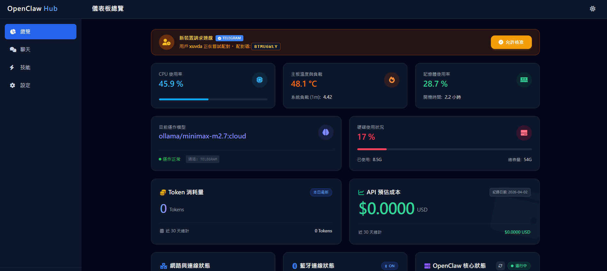

!!! info "🎨 佈景主題小提示"
    控制中心右上角有「太陽 / 月亮」圖示，點擊即可自由切換淺色模式或深色模式。
     
    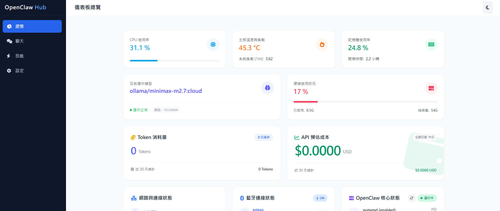