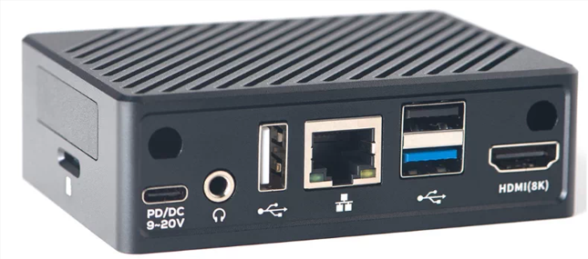
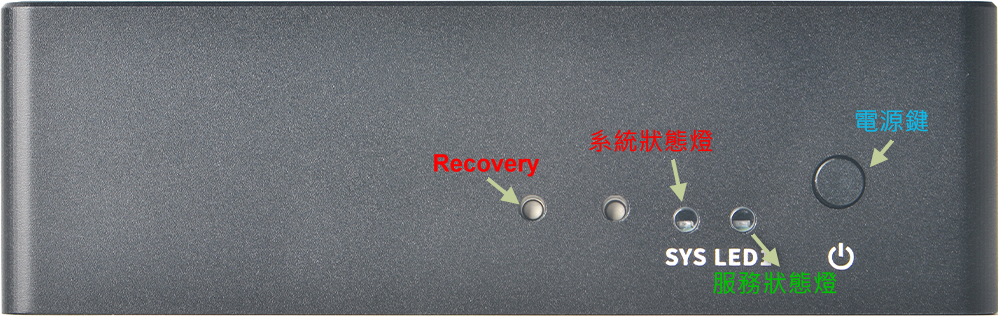

# 設備使用與說明

## 介紹
{ width="600" }
{ width="600" }

## 開機與關機
    預設在電源線插入時即自動開機，若需要關機可按住電源鍵不放直至燈號熄滅即可。

## 燈號
    1. 開機時系統狀態燈會閃爍，直至進入系統正常運作之後恆亮。
    2. 服務狀態燈在第一次使用時會閃爍，表示進入安裝引導精靈模式。
    3. 由安裝精靈模式退出後，服務狀態燈會依據Openclaw服務是否正常而顯示，
       正常時為恆亮，異常時為熄滅。

## 重置與救援
    1. 在紅燈恆亮狀態下，戳住Recovery鍵10秒以上，系統狀態紅燈會閃爍，表示進入重置模式。
    2. 重置系統會進入安裝精靈模式，請按照畫面提示進行操作。
    3. 在紅燈恆亮狀態下，Recovery鍵連續快速戳二下，會開啟臨時WIFI熱點，讓你在不知道任何網路
       資訊的情況下可以正常連進系統觀看，此時LED綠燈閃爍。
